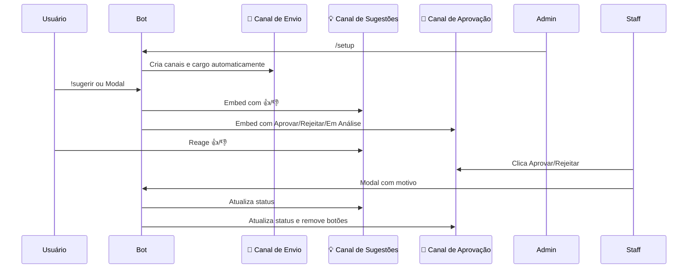

<p align="center">
  
</p>

<p align="center">
  
  
  
  
  
</p>

<br>

<h1 align="center"> 𝙸𝚗𝚜𝚒𝚐𝚑𝚝𝙱𝚘𝚝 • 𝙱𝙾𝚃</h1>

<p align="center">
  Sistema completo de sugestões com votação da comunidade, aprovação por staff e ranking automático.
</p>

<p align="center">
  <b>𝙼𝚊𝚍𝚎 𝙱𝚢 𝚈𝟸𝚔_𝙽𝚊𝚝</b>
</p>

---

## ✦ 𝙰𝙱𝙾𝚄𝚃

> O **InsightBot** é um sistema moderno de sugestões criado em **Node.js + discord.js v14**. Ele permite que membros enviem ideias, votem nas melhores propostas e que a staff aprove ou rejeite com total controle. Com auto-configuração via `/setup`, o bot cria toda a estrutura necessária automaticamente.

---

## ✦ 𝙵𝙴𝙰𝚃𝚄𝚁𝙴𝚂

```txt
⚙️ AUTO SETUP        → /setup cria categoria, 3 canais e cargo de aprovador automaticamente
💡 SUGGESTIONS       → Envio via botão (modal) ou comando !sugerir
📂 CATEGORIES        → 8 categorias: Geral, Bot, Servidor, Eventos, Canais, Cargos, Diversão, Conteúdo
👍 VOTING            → Reações 👍/👎 + comando !votar (um voto por usuário)
🔰 APPROVAL          → Botões Aprovar/Rejeitar/Em Análise no canal da staff
📊 STATISTICS        → !stats com totais, categoria top, votos
🏆 RANKING           → !top com as 10 sugestões mais bem votadas
📁 BACKUP            → Automático a cada 1 hora + console interativo
📝 LOGS              → Sistema de logs coloridos por nível
🛡 PERMISSIONS       → Cargo de aprovador criado automaticamente
🚫 BLACKLIST         → Sistema de blacklist com auto-leave e comandos internos
📢 BOAS-VINDAS       → Mensagem automática ao entrar em novos servidores
📂 ORGANIZAÇÃO       → Configurações salvas por servidor em pastas individuais
```

---

✦ 𝚂𝚈𝚂𝚃𝙴𝙼 𝙵𝙻𝙾𝚆



---

✦ 𝙲𝙾𝙼𝙼𝙰𝙽𝙳𝚂

🤖 Slash (Admin)

```
/setup
  └─ Configura automaticamente todo o sistema (categoria, canais e cargo)
```

---

💡 Sugestões

```
!sugerir <texto>
  └─ Envia uma sugestão (categoria Geral)

!sugerircategoria <cat> <texto>
  └─ Envia sugestão com categoria específica

!categorias
  └─ Lista as categorias disponíveis

!sugestoes [filtro] [página]
  └─ Lista todas as sugestões
     Filtros: pendentes, aprovadas, rejeitadas, analise

!minhassugestoes
  └─ Exibe apenas suas sugestões

!info <id>
  └─ Mostra detalhes de uma sugestão

!votar <id> <up/down>
  └─ Vota em uma sugestão

!top
  └─ Top 10 sugestões mais bem votadas

!stats
  └─ Estatísticas gerais do sistema
```

---

🛠️ Utilidades

```
!help [página]
  └─ Central de ajuda (4 páginas)

!ping
  └─ Latência do bot

!uptime
  └─ Tempo online do bot

!avatar [@usuário]
  └─ Mostra o avatar do usuário

!userinfo [@usuário]
  └─ Informações detalhadas do usuário

!serverinfo
  └─ Informações do servidor

!invite
  └─ Link para convidar o bot
```

---

🧹 Moderação

```
!clear <quantidade>
  └─ Apaga mensagens do canal (requer ManageMessages)

!poll <pergunta> | opção1 | opção2...
  └─ Cria uma enquete (máx. 10 opções)

!lembrete <tempo> <texto>
  └─ Cria lembrete pessoal (ex: 10m Reunião)
```

---

⚙️ Configuração

```
!setup
  └─ Guia de configuração do sistema

!config
  └─ Exibe a configuração atual do servidor
```

---

👑 Comandos Internos (Apenas Owner)

```
!listservers
  └─ Lista todos os servidores onde o bot está

!blacklist
  └─ Mostra a blacklist atual

!blacklistadd <id>
  └─ Adiciona servidor à blacklist (confirmação por botão)

!blacklistremove <id>
  └─ Remove servidor da blacklist (confirmação por botão)

!leave <id>
  └─ Retira o bot de um servidor (confirmação por botão)
```

---

✦ 𝙿𝙴𝚁𝙼𝙸𝚂𝚂𝙸𝙾𝙽𝚂

```txt
👑 DONO DO BOT
   ✔ Comandos internos (!listservers, !blacklist, !leave)
   ✔ Controle total da blacklist
   ✔ Todas as ações administrativas

🔰 ADMINISTRADOR
   ✔ Usar /setup para configurar o sistema
   ✔ Atribuir cargo de Aprovador de Sugestões

🛡 APROVADOR DE SUGESTÕES
   ✔ Aprovar / Rejeitar / Colocar em análise
   ✔ Acesso ao canal de aprovação

👤 USUÁRIOS COMUNS
   ✔ Enviar sugestões
   ✔ Votar com 👍/👎
   ✔ Ver estatísticas e ranking
```

---

✦ 𝚂𝙴𝚃𝚄𝙿

Pré-requisitos

· Node.js 16.9.0 ou superior
· Token de bot Discord
· ID do dono do bot

---

Configuração no Servidor

1. Adicione o bot ao servidor com permissão de Administrador
2. Um Administrador do servidor deve digitar /setup
3. O bot criará automaticamente:
   · Categoria Sistema de Sugestões
   · Canal 📨-enviar-sugestão
   · Canal 💡-sugestões
   · Canal 🔰-aprovação
   · Cargo Aprovador de Sugestões
4. Atribua o cargo Aprovador de Sugestões aos membros da staff
5. Pronto! O sistema está funcionando

---

## ✦ 𝙳𝙰𝚃𝙰𝙱𝙰𝚂𝙴

```
Nome do Servidor ID/
├─ suggestions_config.json → Canais configurados
├─ approval_roles.json     → Cargos de aprovação
└─ suggestion_votes.json   → Histórico de votos

blacklist.json              → Lista de servidores bloqueados
backups/                    → Backups automáticos (mantém os últimos 24)
logs/                       → Logs diários detalhados
```
✔ Leve
✔ Persistente
✔ Organizado por servidor
✔ Fácil manutenção

---

✦ 𝙾𝙱𝙹𝙴𝙲𝚃𝙸𝚅𝙴


✔ Dar voz à comunidade
✔ Facilitar a gestão de ideias
✔ Criar um ambiente colaborativo
✔ Automatizar o feedback
✔ Crescimento escalável e independente
✔ Controle total para o dono do bot


---

✦ 𝙻𝙸𝙲𝙴𝙽𝚂𝙴

Este projeto está licenciado sob a licença MIT. Veja o arquivo LICENSE para mais detalhes.

---

✦ 𝚂𝚄𝙿𝙿𝙾𝚁𝚃

Encontrou um bug? Tem uma sugestão? Entre em contato com o desenvolvedor:

· Discord: y2k_nat

---

<p align="center">
  <b>📌 Status: 🟢 Online • ⚡ Estável • 🔒 Seguro</b>
</p>

<p align="center">
  <b>© 2026 InsightBot • 𝙼𝚊𝚍𝚎 𝙱𝚢 𝚈𝟸𝚔_𝙽𝚊𝚝</b>
</p>
