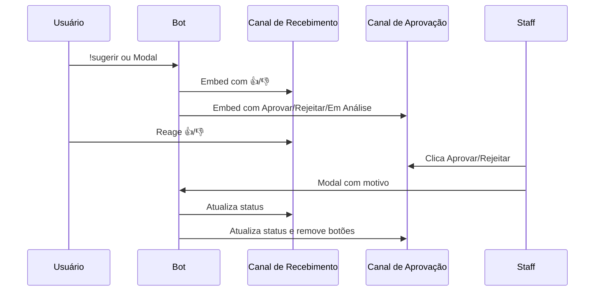

<p align="center">
  
</p>

<p align="center">
  
  
  
  
  
</p>

<br>

<h1 align="center">💡 𝙸𝚗𝚜𝚒𝚐𝚑𝚝𝙱𝚘𝚝 • 𝙱𝙾𝚃</h1>

<p align="center">
  Sistema completo de sugestões com votação da comunidade, aprovação por staff e ranking automático.
</p>

<p align="center">
  <b>𝙼𝚊𝚍𝚎 𝙱𝚢 𝚈𝟸𝚔_𝙽𝚊𝚝</b>
</p>

---

## ✦ 𝙰𝙱𝙾𝚄𝚃

> O **InsightBot** é um sistema moderno de sugestões criado em **Node.js + discord.js v14**. Ele permite que membros enviem ideias, votem nas melhores propostas e que a staff aprove ou rejeite com total controle.

---

## ✦ 𝙵𝙴𝙰𝚃𝚄𝚁𝙴𝚂

```txt
💡 SUGGESTIONS      → Envio via botão (modal) ou comando !sugerir
📂 CATEGORIES       → 8 categorias: Geral, Bot, Servidor, Eventos, Canais, Cargos, Diversão, Conteúdo
👍 VOTING           → Reações 👍/👎 + comando !votar (um voto por usuário)
🔰 APPROVAL         → Botões Aprovar/Rejeitar/Em Análise no canal da staff
📊 STATISTICS       → !stats com totais, categoria top, votos
🏆 RANKING          → !top com as 10 sugestões mais bem votadas
📁 BACKUP           → Automático a cada 1 hora + console interativo
📝 LOGS             → Sistema de logs coloridos por nível
🛡 PERMISSIONS      → Cargos de aprovação configuráveis via /approvalroles
```

---

✦ 𝚂𝚈𝚂𝚃𝙴𝙼 𝙵𝙻𝙾𝚆



---

### 🤖 Slash (Owner)

| Comando | Descrição |
|---------|-----------|
| `/suggestions #canal` | Define o canal do botão de sugestões |
| `/suggestionschannel #canal` | Define o canal de recebimento (votos) |
| `/approvalchannel #canal` | Define o canal de aprovação (staff) |
| `/approvalroles` | Abre menu dropdown para escolher cargos de staff |

---

### 💡 Sugestões

| Comando | Descrição |
|---------|-----------|
| `!sugerir <texto>` | Envia uma sugestão (categoria Geral) |
| `!sugerircategoria <cat> <texto>` | Envia sugestão com categoria específica |
| `!categorias` | Lista as categorias disponíveis |
| `!sugestoes [filtro] [página]` | Lista todas as sugestões (filtros: pendentes, aprovadas, rejeitadas, analise) |
| `!minhassugestoes` | Exibe apenas suas sugestões |
| `!info <id>` | Mostra detalhes de uma sugestão |
| `!votar <id> <up/down>` | Vota em uma sugestão |
| `!top` | Top 10 sugestões mais bem votadas |
| `!stats` | Estatísticas gerais do sistema |

---

### 🛠️ Utilidades

| Comando | Descrição |
|---------|-----------|
| `!help [página]` | Central de ajuda (4 páginas) |
| `!ping` | Latência do bot |
| `!uptime` | Tempo online do bot |
| `!avatar [@usuário]` | Mostra o avatar do usuário |
| `!userinfo [@usuário]` | Informações detalhadas do usuário |
| `!serverinfo` | Informações do servidor |

---

### 🧹 Moderação (Staff)

| Comando | Descrição |
|---------|-----------|
| `!clear <quantidade>` | Apaga mensagens do canal (requer ManageMessages) |
| `!poll <pergunta> \| opção1 \| opção2...` | Cria uma enquete |

---

### ⚙️ Configuração

| Comando | Descrição |
|---------|-----------|
| `!setup` | Guia de configuração do sistema |
| `!config` | Exibe a configuração atual do servidor |

---

✦ 𝙋𝙀𝙍𝙈𝙄𝙎𝙎𝙄𝙊𝙉𝙎

👑 DONO DO BOT
✔ Slash commands de configuração
✔ Todas as ações administrativas

🔰 STAFF (cargos configurados)
✔ Aprovar / Rejeitar / Colocar em análise
✔ Comandos de moderação (!clear, !poll)

👤 USUÁRIOS COMUNS
✔ Enviar sugestões
✔ Votar
✔ Ver estatísticas e ranking

---

## ✦ 𝘿𝘼𝙏𝘼𝘽𝘼𝙎𝙀

| Arquivo / Pasta | Descrição |
|----------------|-----------|
| `suggestions_config.json` | Canais configurados por servidor |
| `approval_roles.json` | Cargos de aprovação |
| `suggestion_votes.json` | Histórico de votos |
| `backups/` | Backups automáticos (mantém os últimos 24) |
| `logs/` | Logs diários detalhados |

✔ Leve
✔ Persistente
✔ Fácil manutenção

---

✦ 𝙊𝘽𝙅𝙀𝘾𝙏𝙄𝙑𝙀

✔ Dar voz à comunidade
✔ Facilitar a gestão de ideias
✔ Criar um ambiente colaborativo
✔ Automatizar o feedback

---

📌 Status

🟢 Online • ⚡ Estável • 🔒 Seguro

---

<p align="center">
  <b>© 2026 InsightBot • 𝙼𝚊𝚍𝚎 𝙱𝚢 𝚈𝟸𝚔_𝙽𝚊𝚝</b>
</p>
